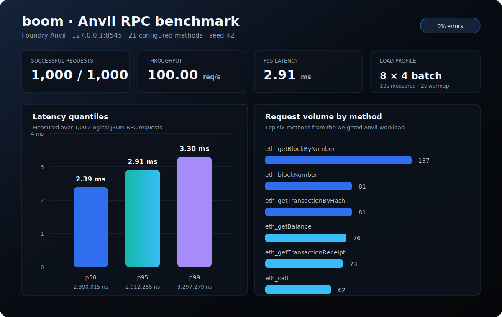

# boom

`boom` is a Rust CLI for benchmarking, probing, and comparing Ethereum-compatible RPC endpoints.

This project was AI-generated by OpenAI Codex and is heavily inspired by [`paradigmxyz/flood`](https://github.com/paradigmxyz/flood).

## What Boom Does

- Benchmarks Ethereum JSON-RPC endpoints with realistic, seeded requests.
- Provides an interactive colored `boom run` menu for common workflows.
- Runs fixed-rate, ramped-rate, batch, and concurrency-driven workloads.
- Compares two RPC endpoints with the same workload.
- Probes endpoint health and builds method discovery catalogs.
- Finds saturation limits against explicit latency and error budgets.
- Benchmarks JSON-RPC over HTTP and WebSocket transports.
- Supports Engine API JWT authentication.
- Probes Engine REST/SSZ endpoints.
- Writes machine-readable artifacts, OpenMetrics output, and clean HTML/Markdown reports.
- Supports regression gates, live Prometheus scraping, deterministic mock RPC tests, and multi-step scenarios.

## Install

From the repository root:

```bash
make install
```

Then use the installed binary:

```bash
boom probe http://localhost:8545
boom bench http://localhost:8545 --eth --duration 30s
```

### Install a release binary

Release archives are published for Linux, macOS, and Windows. On Unix, the installer
verifies the SHA-256 checksum before installing to `~/.local/bin`:

```bash
curl -fsSL https://raw.githubusercontent.com/Soubhik-10/boom/main/install.sh | sh
```

On Windows PowerShell:

```powershell
irm https://raw.githubusercontent.com/Soubhik-10/boom/main/install.ps1 | iex
```

Set `BOOM_VERSION` to install a specific release and `BOOM_INSTALL_DIR` to choose the
destination directory. Building from source remains available with `cargo install`.

The release workflow publishes stable artifacts for `v*` tags and a rolling `nightly`
pre-release on schedule. Nightly/manual runs pause when `main` has been inactive beyond
the configured window; use the workflow's `force` input to override that gate.

Boom is transport/auth agnostic: paid RPC subscriptions work when the provider gives you
an HTTP endpoint plus an API key or JWT. Configure those credentials through `header_env`,
`headers`, or `jwt_env`; Boom does not manage payment, subscription state, quotas, or billing.

During development, use Cargo directly:

```bash
cargo run -q -- bench http://localhost:8545 --eth
```

## Quick Start

Start the interactive menu:

```bash
boom run
boom run http://localhost:8545
```

Run a small local RPC benchmark:

```bash
boom bench http://localhost:8545 --eth --duration 30s --out runs/local-eth
```

Run a heavier local node benchmark:

```bash
boom bench http://localhost:8545 --all --duration 120s --concurrency 512 --out runs/heavy
```

Run a fixed-rate benchmark:

```bash
boom bench http://localhost:8545 --all --rps 500 --duration 60s --out runs/rate-500
```

Run a ramped-rate benchmark:

```bash
boom bench http://localhost:8545 --all --ramp 100:1000 --duration 5m --out runs/ramp
```

Compare two endpoints:

```bash
boom compare http://localhost:8545 http://localhost:9545 --all --rps 500 --out runs/compare
```

Generate or open a report:

```bash
boom report --run runs/heavy --print
boom report --run runs/heavy --open
boom report --run runs/heavy --prompt
```

When `boom report --run <dir>` is used in a terminal without `--open`, `--print`, or `--no-prompt`, Boom prompts by default. The generated HTML report uses a dark dashboard theme and includes error reason cards from `errors.jsonl`.

Find the sustainable request rate for a node:

```bash
boom find-limit http://localhost:8545 --scenario explorer --target-p95 250 --max-error-rate 1 --out runs/limit
```

Export metrics for Prometheus/OpenMetrics consumers:

```bash
boom metrics --run runs/heavy --print
boom bench http://localhost:8545 --eth --duration 60s --live-metrics 127.0.0.1:9464
boom gate --baseline runs/baseline --run runs/candidate --out runs/gate
```

Run a configured multi-step scenario:

```bash
boom scenario --config configs/examples/scenario.toml --scenario block_transactions --out runs/scenario
```

## Verified Foundry Anvil example

The repository includes a dedicated local-node profile at
[`configs/examples/anvil-rpc.toml`](configs/examples/anvil-rpc.toml). It exercises 21
Anvil-safe methods, including block, transaction, account, call, fee, storage, log, and
network RPCs with deterministic weighting, a two-second warmup, four-call HTTP batches,
100 requested requests per second, and a 1,000-request safety budget.

Run it against a fresh Anvil node:

```bash
anvil --host 127.0.0.1 --port 8545
# Seed one transaction so the transaction-aware placeholders resolve.
curl -s http://127.0.0.1:8545 \
  -H 'content-type: application/json' \
  --data '{"jsonrpc":"2.0","id":1,"method":"eth_sendTransaction","params":[{"from":"0xf39Fd6e51aad88F6F4ce6aB8827279cffFb92266","to":"0x70997970C51812dc3A010C7d01b50e0d17dc79C8","value":"0x1"}]}'
boom bench --config configs/examples/anvil-rpc.toml --target local --out runs/anvil-rpc --no-prompt
boom report --run runs/anvil-rpc --out runs/anvil-rpc --no-prompt
```

The verified smoke run completed all 1,000 requests successfully (zero RPC, transport,
or timeout errors) at 100.00 requests/second. Aggregate latency was 2.39 ms p50,
2.91 ms p95, and 3.30 ms p99 over 9.97 seconds. The chart below is a snapshot of that
run; the nanosecond values remain in `run.json` for exact comparisons.



*Figure: `runs/anvil-rpc` generated from the dedicated Anvil config, not from a client-specific
or remote-node run.*

Probe a full method catalog:

```bash
boom catalog http://localhost:8545 --all
```

Benchmark WebSocket JSON-RPC:

```bash
boom ws-bench ws://localhost:8546 --method eth_blockNumber --duration 30s --out runs/ws
```

## Documentation

- [CLI usage](docs/usage.md): every command, option, artifact, and workflow.
- [Config guide](docs/config.md): `config.toml` structure, fields, placeholders, weights, and examples.

## Workload Presets

Boom includes built-in JSON-RPC suites:

- `--eth`: core Ethereum JSON-RPC methods.
- `--debug`: `debug_*` tracing methods.
- `--trace`: OpenEthereum/Erigon-style `trace_*` methods.
- `--txpool`: transaction pool methods.
- `--net`: network metadata methods.
- `--web3`: web3 namespace methods.
- `--all`: every built-in suite.

Scenario shortcuts are also available:

```bash
boom bench http://localhost:8545 --scenario light
boom bench http://localhost:8545 --scenario explorer
boom bench http://localhost:8545 --scenario archive
boom bench http://localhost:8545 --scenario debug-heavy
boom bench http://localhost:8545 --scenario simulate
boom bench http://localhost:8545 --scenario txpool
```

## Artifacts

Each benchmark run writes:

```text
manifest.json   effective config, workload, provenance, and completion state
seed.json       live data used to resolve placeholders
run.json        complete structured run summary
metrics.csv     per-method aggregate metrics
samples.csv     per-second time-series samples
errors.jsonl    capped error samples for debugging
openmetrics.prom generated Prometheus/OpenMetrics text, when requested
summary.md      generated Markdown report, when requested
report.html     generated HTML report, when requested
```

Compare runs write:

```text
left/           left endpoint benchmark artifacts
right/          right endpoint benchmark artifacts
compare.json    structured comparison summary
compare.md      Markdown comparison report
compare.html    HTML comparison report
```

## Make Targets

Common development shortcuts:

```bash
make ci
make check
make clippy
make test
make install
make run RPC=http://localhost:8545
make probe RPC=http://localhost:8545
make catalog RPC=http://localhost:8545
make bench RPC=http://localhost:8545 OUT=runs/local
make live RPC=http://localhost:8545 OUT=runs/live
make bench-rate RPC=http://localhost:8545 RPS=500 OUT=runs/rate
make bench-ramp RPC=http://localhost:8545 RAMP=100:1000 OUT=runs/ramp
make bench-compare LEFT=http://localhost:8545 RIGHT=http://localhost:9545 OUT=runs/compare
make find-limit RPC=http://localhost:8545 OUT=runs/limit
make ws-bench WS=ws://localhost:8546 OUT=runs/ws
make report-open OUT=runs/local
make metrics OUT=runs/local
make config-check CONFIG=configs/examples/basic-eth.toml
make gate BASELINE=runs/baseline RUN=runs/candidate
make scenario CONFIG=configs/examples/scenario.toml SCENARIO=block_transactions OUT=runs/scenario
```

## Safety And Scope

Boom only sends requests to endpoints you explicitly provide. It is intended for owned infrastructure, local development networks, public endpoints that allow benchmarking, and controlled client comparison work. Use conservative `--rps`, `--duration`, and `--concurrency` values unless you have permission and capacity to run heavier tests.

## License

Licensed under either of:

- Apache License, Version 2.0 ([LICENSE-APACHE](LICENSE-APACHE))
- MIT license ([LICENSE-MIT](LICENSE-MIT))

at your option.
